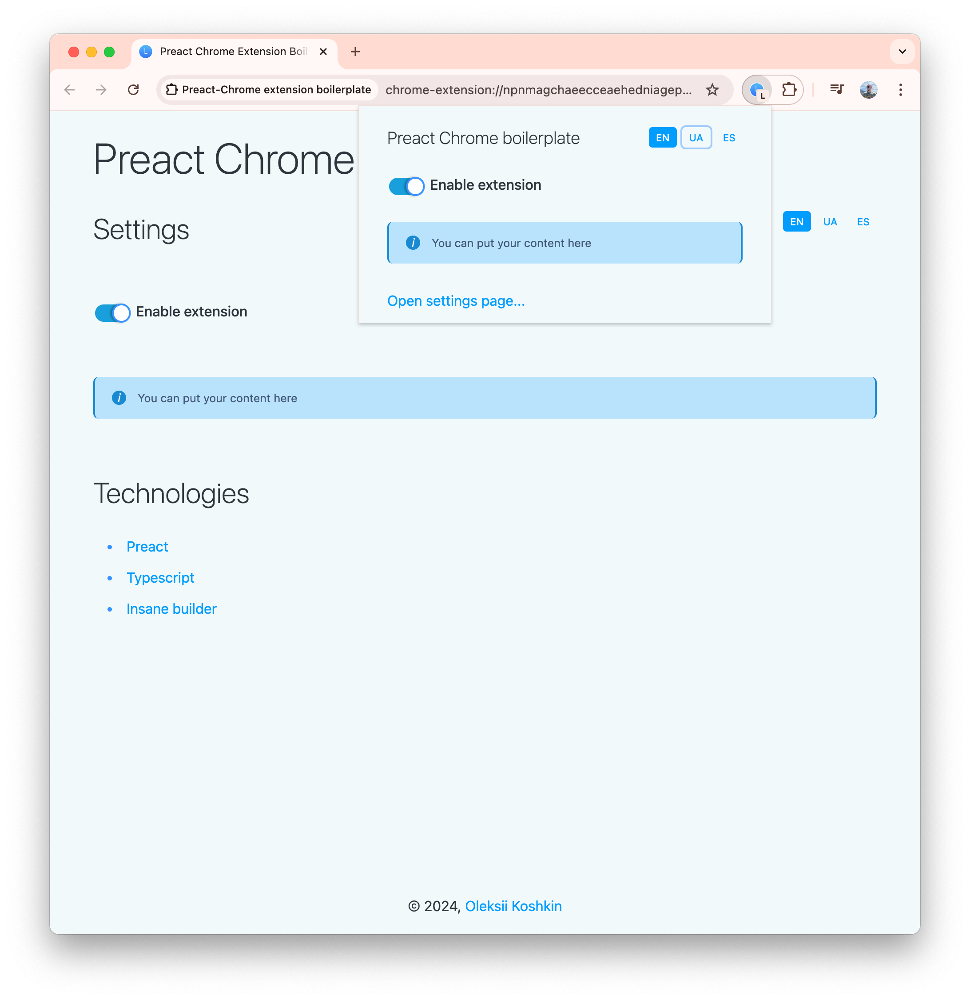
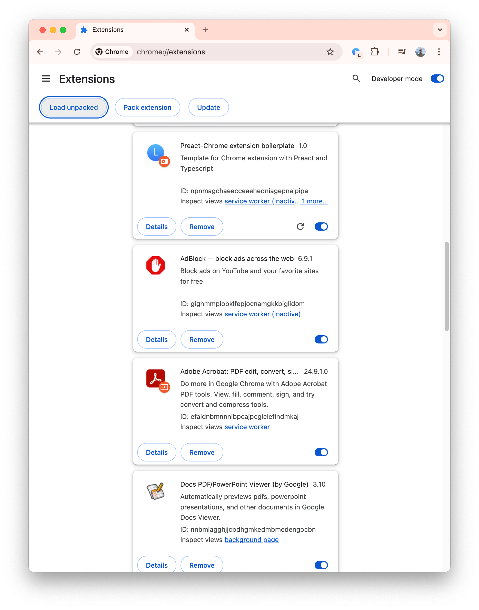

# Preact Chrome extension

This project uses [Preact](https://preactjs.com/) and Typescript.

Here is [Medium Article](https://lexeykoshkin.medium.com/chrome-extension-with-preact-and-ts-850e40bf016c) with more details.

## Installation

### 1. Prerequisites

Install [Bun](https://bun.sh/docs/installation) (can be NPM with a minor changes):

`curl -fsSL https://bun.sh/install | bash`

### 2. Dependencies

Install dependencies:

`bun i`

### 3. Build

Build:

`bun run build`

#### Dev server

`bun start`
(will update `popup` and `settings` pages, for content script you need to reload extension)

### 4. Usage

Add to Chrome:

1. Build with `bun run build`
2. `Window → Extensions → Load unpacked`
3. Select `dist` folder

Then you can pack it and publish. Enjoy!